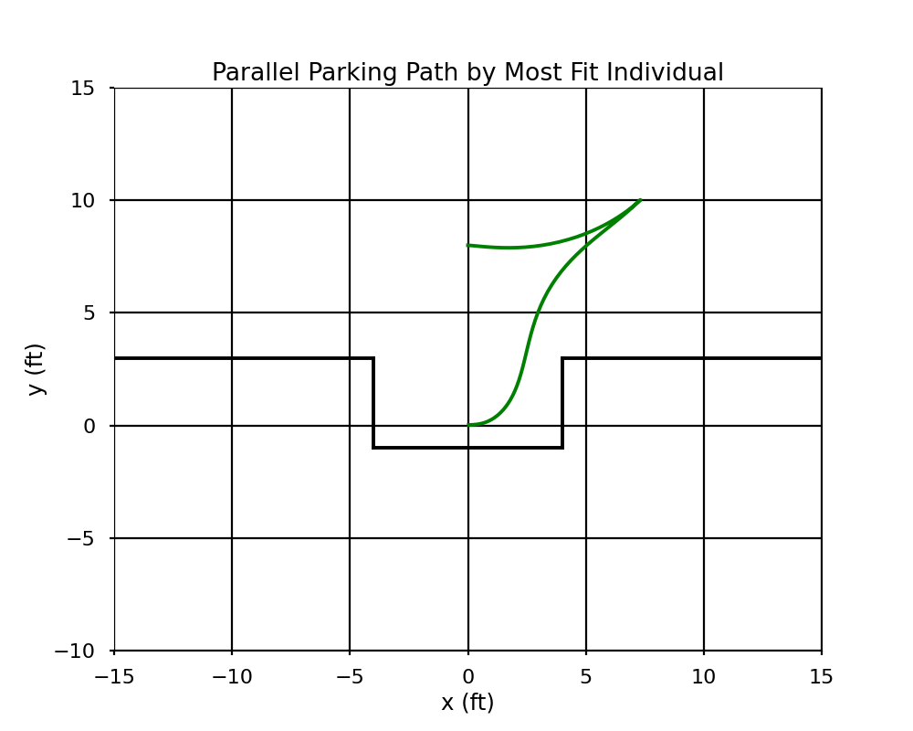

# Parallel Parker
This genetic algorithm uses parameters to simulate the parallel parking process by adjusting the vehicle's steering angle (Gamma) and acceleration (Beta) over time, aiming to achieve an optimal parking maneuver with minimal cost.
# Example Run (55 Generations)
